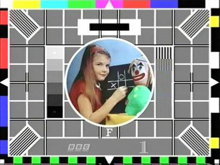
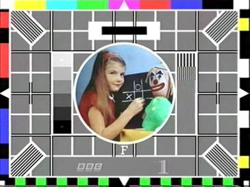
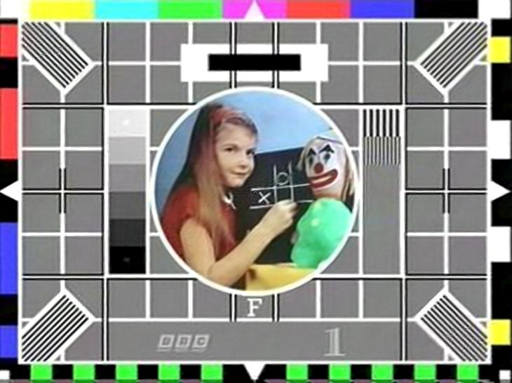
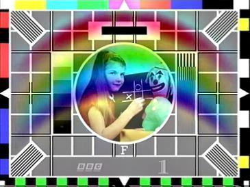

# Homework 7

 This assignment implements the model denoted in the [Siren paper](https://www.vincentsitzmann.com/siren/). The model is used to recreate their example of image fitting on Testcard_f.jpg and is also upscaled, as the model can accept a continous stream of input unlike a regular image. The upscaled image is (730 × 546), doubled the resolution of the original image (365x273). The upscaled image was shown to interpolate points effectively with little additional artifcats being added in the process. The poission image blending from the paper was also implemented combining a rainbow with testcard F in the image gradient space. The model learned using only the image gradients, producing a combined rgb image of the rainbow and testcard F.
 ## How to run
- run normal imagefit and calculate upscaled version of image ```python main.py```
- run poisson image blend ```python poisson.py```

 ## Loss Metrics
 - Image Fit Loss
```Step 1499; loss => 0.0003: 100%| 1500/1500 [02:04<00:00, 12.04it/s]```

 - Test Card F loss
```Step 4999; loss => 0.0089: 100%| 5000/5000 [07:48<00:00, 10.68it/s]```

## Original Image


## Learned Version from Siren



## Upscaled Version from Trained Model 


## Poision Image Blending Example


## Training Gifs


